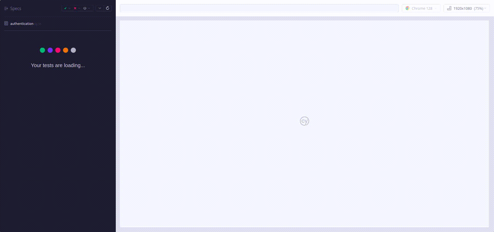
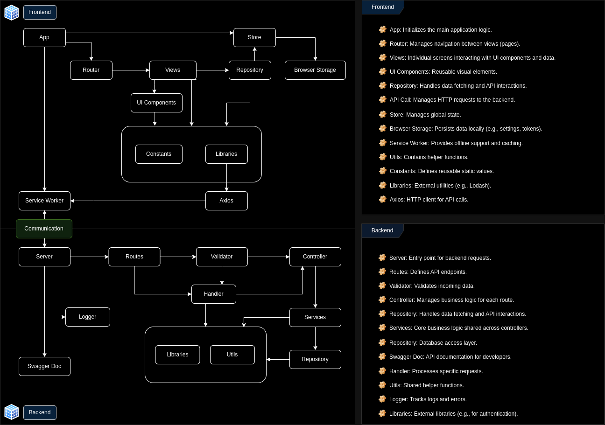

# Fullstack setup

[](https://lerna.js.org/)
[](https://vitejs.dev/)
[](https://react.dev/)
[](https://vuejs.org/)
[](https://vitejs.dev/)
[](https://www.cypress.io/)
[](https://nginx.org/en/download.html)
[](https://tailwindcss.com/)
[](https://prettier.io/)
[](https://eslint.org/)
[](https://typicode.github.io/husky/#/)

## Quick Working Preview

### Setup and test command

The project includes ready-to-use bash scripts to streamline setup, database management, and testing. These scripts simplify the process, but if you're using an unsupported OS, you can execute the commands manually as outlined in the script files.


1. **Setup and Initialization**  
   Run `init.sh` to install dependencies and set up the backend database migrations:

    ```bash
    ./init.sh
    ```

2. **Database Management**
   Use `db.sh` to reset the database and apply migrations. Pass your MySQL credentials as arguments:

    ```bash
    ./db.sh -u <mysql_user> -p <mysql_password>
    ```

3. **Run Tests**
   Execute all tests, including backend tests and Cypress E2E tests, using `test.sh`:

    ```bash
    ./test.sh
    ```

    This script will:

    - Run backend tests.
    - Start frontend and backend services.
    - Execute Cypress component and E2E tests.

| Script    | Purpose                                                                                      |
| --------- | -------------------------------------------------------------------------------------------- |
| `init.sh` | Installs dependencies and runs backend migrations.                                           |
| `db.sh`   | Drops and recreates the database, applies migrations, and cleans up log/backups directories. |
| `test.sh` | Runs backend tests, Cypress component tests, and E2E tests.                                  |

### Cypress E2E Test Execution

Below is a demonstration of the Cypress End-to-End (E2E) Test Execution, showcasing the authentication flow



## Table of Contents

- [Project Setup](#project-setup)
- [Technologies](#technologies)
    - [Frontend](#frontend)
    - [Backend](#backend)
    - [Database](#database)
    - [Additional Tools](#additional-tools)
    - [Testing and CI/CD](#testing-and-cicd)
- [Key Features](#key-features)
- [Code Architecture Flow Diagram](#code-architecture-flow-diagram)
- [Installation](#installation)
- [Development Workflow](#development-workflow)
- [Deployment](#deployment)
- [GitHub Actions Workflow](#github-actions-workflow)

## Project Setup

This repository provides a **common project setup** for web apps using **React**, **Vue**, **Node.js**, and essential tools for frontend and backend development, testing, and automation.

## Technologies

### Frontend

- **React & Vue**: Popular frontend framework for building user interfaces.
- **Vite**: Fast build tool for modern web development with support for hot module replacement.
- **TypeScript**: Superset of JavaScript providing static typing for better code quality.
- **Tailwind CSS**: Utility-first CSS framework for quickly styling components.
- **Service Worker**: Enables background tasks and improves performance in Progressive Web Apps (PWA).
- **Vite Plugins**: Added for optimizing PWA features and removing unnecessary test case IDs in production builds.

### Backend

- **Node.js**: JavaScript runtime for building scalable backend services.
- **Error/Security Middlewares**: Handles error responses, security measures, and logs access/errors for auditing.
- **Swagger**: Used for API documentation, providing a user-friendly interface to explore and test API endpoints.

### Database

- **MySQL**: Relational database used for storing and managing data.

### Additional Tools

- **Lerna**: Monorepo tool to manage multiple projects and dependencies.
- **Prettier**: Code formatter that ensures consistent coding styles.
- **ESLint**: Linter for identifying and fixing code quality issues.
- **JSCPD**: Tool for detecting duplicate code across the codebase.
- **Husky**: Git hooks tool used for running automated tasks such as code formatting with Prettier and linting with ESLint during pre-commit.

### Testing and CI/CD

- **Cypress**: Component and End-to-End testing framework for frontend applications.
- **Jest**: Used in backend services for unit and integration testing.
- **GitHub Actions**: CI/CD tool used to automate code quality checks, run Cypress tests, and manage workflows for pull requests and pushes.

## Key Features

- **Monorepo Architecture**: Efficiently manage frontend and backend within a single repository using Lerna.
- **Comprehensive Testing**: Includes unit, integration, component, and end-to-end tests with Jest and Cypress.
- **Performance Optimization**: Utilizes Vite for fast builds and Service Workers for PWA capabilities.
- **Automated Workflows**: GitHub Actions ensure code quality and testing on every pull request.
- **Seamless Deployment**: Easy deployment process with Nginx and PM2.

## Code Architecture Flow Diagram



## Installation

1. **Install dependencies**:

    ```bash
    npm ci
    ```

2. **Create a `.env` file**: Copy the `.env-example` file to `.env` and update the values with your specific configuration.
    ```bash
    cp .env-example .env
    ```
3. **Run backend migrations**:

    ```bash
    npx lerna run migrate --stream --scope=backend
    ```

4. **Start the development server** (optional, if applicable):
    ```bash
    npx lerna run dev --stream --scope=frontend-react --scope=backend
    ```

## Development Workflow

- Start the frontend and backend:
    ```bash
    npx lerna run dev --stream --scope=frontend-react --scope=backend
    ```
- Run tests:

    ```bash
    npx lerna run test --stream --scope=backend
    npx lerna run cy:run --stream --scope=frontend-react -- --component --browser chrome

    # Need to run the app before end to end test
    npx lerna run dev --stream --scope=frontend-react --scope=backend -- --mode test
    npx lerna run cy:run --stream --scope=frontend-react -- --e2e --browser chrome
    ```

## Deployment

1. **Build**:

    ```bash
    npx lerna run build --stream --scope=frontend-react --scope=backend
    ```

2. **Deploy**:

    ```bash
    # Frontend
    pm2 serve FOLDER_NAME PORT --name APP_NAME --spa --time

    # Backend
    pm2 start INITIAL_FILE --name APP_NAME --time
    ```

3. **Server Configuration**

    - **Nginx**: `setup/config/nginx.conf`
    - **Apache**: `setup/config/apache.conf`

    ```bash
    # Update and upgrade system packages
    sudo apt update && sudo apt upgrade -y

    # Install Apache
    sudo apt install apache2 -y
    sudo systemctl enable apache2
    sudo systemctl start apache2

    # Install NVM and Node.js
    curl -fsSL https://raw.githubusercontent.com/nvm-sh/nvm/v0.39.4/install.sh | bash
    source ~/.bashrc
    nvm install --lts

    # Install PM2
    npm i -g pm2
    sudo ln -s /home/ubuntu/.nvm/versions/node/$(nvm current)/bin/node /usr/bin/node
    sudo ln -s /home/ubuntu/.nvm/versions/node/$(nvm current)/bin/npm /usr/bin/npm
    sudo ln -s /home/ubuntu/.nvm/versions/node/$(nvm current)/bin/pm2 /usr/bin/pm2

    # Install MySQL
    sudo apt install mysql-server -y
    sudo mysql_secure_installation
    sudo mysql -u root
    CREATE USER 'username'@'localhost' IDENTIFIED BY 'password';
    GRANT ALL PRIVILEGES ON database_name.* TO 'username'@'localhost';
    FLUSH PRIVILEGES;

    # Start pm2 app
    pm2 serve web 3000 --name web --spa
    pm2 start bundle.js --name backend
    pm2 save
    pm2 startup

    # Configure Apache for proxy and SSL
    sudo a2enmod proxy proxy_http proxy_wstunnel rewrite headers
    sudo a2ensite domain.conf
    sudo a2dissite 000-default.conf

    # Install and configure Certbot for SSL
    sudo apt install certbot python3-certbot-apache -y
    sudo certbot --apache -d domain -d www.domain
    sudo certbot renew --dry-run

    ```

- **Simple node app**

    - npm init -y
    - npm install express
    - nano bundle.js

    ```bash
    const express = require('express');
    const app = express();
    const port = 3006;

    // Define a simple route
    app.get('/', (req, res) => {
    res.send('Hello, World! This is a simple Node.js app.');
    });

    // Start the server
    app.listen(port, () => {
    console.log(`Server running at http://localhost:${port}`);
    });
    ```

    - node bundle.js

- **Simple web app**

    - nano index.html

    ```bash
    <!DOCTYPE html>
    <html lang="en">
    <head>
        <meta charset="UTF-8">
        <meta name="viewport" content="width=device-width, initial-scale=1.0">
        <title>Simple Web App</title>
        <style>
            body {
                margin: 0;
                height: 100vh;
                display: flex;
                justify-content: center;
                align-items: center;
                font-family: Arial, sans-serif;
                background-color: #f0f0f0;
            }
            h1 {
                font-size: 48px;
                color: #333;
            }
        </style>
    </head>
    <body>
        <h1>APPNAME</h1>
    </body>
    </html>
    ```

## GitHub Actions Workflow

This repository includes a GitHub Actions workflow for automating code quality checks and running Cypress End-to-End (E2E) tests on pull requests and pushes to the `master` branch.

### Workflow: Code Quality Check and Cypress E2E Test

The workflow is triggered on:

- Pull requests targeting the `master` branch (on open, synchronize, and reopen events).
- Push events to the `master` branch.

The workflow includes four jobs:

1. **Code Quality Check**:

    - **Run ESLint**: Runs ESLint to check for code quality issues with `npm run lint`.
    - **Run JSCPD**: Runs JSCPD to detect duplicate code with `npm run check-duplication`. If the duplication check fails, a summary of the results is uploaded to the GitHub summary.

2. **Backend Test**:

    - **MySQL Service**: Sets up a MySQL service for the backend tests.
    - **Backend Setup**: Installs dependencies, sets up the backend environment using environment variables, and runs database migrations.
    - **Jest Test**: Runs Jest tests for the backend.

3. **Cypress Component Test**:

    - **Node.js Setup**: Sets up Node.js (version 20.14.0) for the frontend.
    - **Frontend Setup**: Installs dependencies and sets up the frontend environment using environment variables.
    - **Cypress Component Testing**: Runs Cypress component tests.
    - **Upload Test Artifacts**: If any tests fail, artifacts such as screenshots are uploaded for further investigation.

4. **Cypress E2E Desktop/Mobile**:

    - **MySQL Service**: Sets up a MySQL service for the E2E tests.
    - **Frontend and Backend Setup**: Installs dependencies and sets up both the frontend and backend environments using environment variables. Also runs backend migrations.
    - **Run Services**: Uses `lerna` to start both the frontend and backend services.
    - **Cypress E2E Testing**: Runs Cypress E2E tests against the running frontend and backend services.
    - **Upload Test Artifacts**: If any tests fail, artifacts like screenshots are uploaded for review.

5. **Deployment CD**:

    - **Backend Deployment**:

        - **Environment Setup**: Installs dependencies and configures the backend environment using `.env` variables.
        - **Build and Deploy**: Builds the backend using `npm run build` in the `packages/backend` directory and deploys the built files to the production server using `scp`.

    - **Frontend Deployment**:

        - **Environment Setup**: Installs dependencies and configures the frontend environment using `.env` variables.
        - **Build and Deploy**: Builds the frontend using `npm run build` in the `packages/frontend-react` directory and deploys the built files to the production server using `scp`.

    - **Selective Deployment**: The workflow is triggered for the `master` branch, deploying only the changed parts (frontend or backend) based on file paths.

This workflow ensures that every code change passes linting, code duplication checks, and comprehensive testing (unit, component, and E2E) before merging into the `master` branch.
